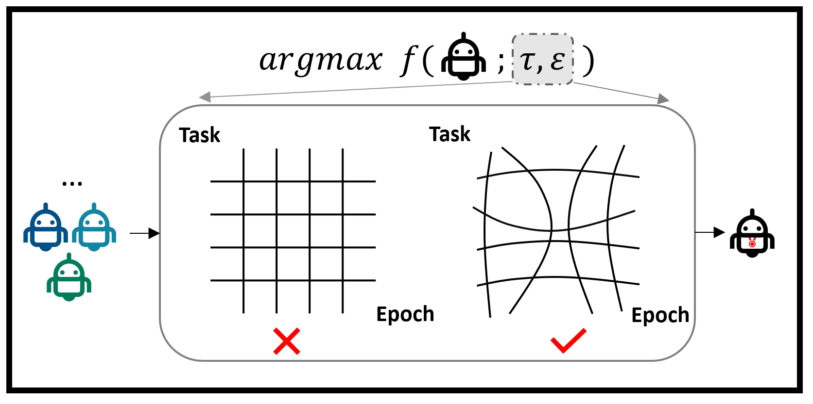

# Neural Fidelity Warping for Efficient Robot Morphology Design
#### [[Video]](https://youtu.be/TDpqxWbpirI) [[Paper]](https://arxiv.org/abs/2012.04195) [[Project Website]](https://youtu.be/TDpqxWbpirI)

[Sha Hu](https://husha1993.github.io/)<sup>1</sup>, Zeshi Yang<sup>1</sup>, [Greg Mori](https://www.cs.sfu.ca/~mori/)<sup>1</sup>

<sup>1</sup>Simon Fraser Unversity

<p align="center">

</p>
</img>

This is the official implementation of the paper "**Neural Fidelity Warping for Efficient Robot Morphology Design**".


## Getting started

Please first download and install the anaconda3:
```
wget https://repo.anaconda.com/archive/Anaconda3-2019.10-Linux-x86_64.sh
bash ~/Anaconda3-2019.10-Linux-x86_64.sh
```
Then create a conda virtual environment and install all required packages:
```
conda env create --file nfwbo.yaml --name nfwbo
```
Set the environment variables that specify the python path:
```
export PYTHONPATH="~/FWBO:$PYTHONPATH"
```

## Commands
|Method|Env|Command                                              |
| -----    | --- |-----------------------------------------------------|
| Random | Cheetah | python nfwbo/main.py --config random_cheetahurdf13lr_N200_T200 --m random|
| CMA-ES | Cheetah | python nfwbo/main.py --config cmaes_cheetahurdf13lr_N200_T200 --m cmaes|
| BO  | Cheetah | python nfwbo/main.py --config sfbo_es_cheetahurdf13lr_N200_T200 --m sfbo|
| HPC-BBO| Cheetah | python nfwbo/main.py --config hpcbbo_es_cheetahurdf13lr_N200_T200 --m hpcbbo|
| BOCA| Cheetah |python nfwbo/main.py --config boca_cmfes_cheetahurdf13lr_N200_T200 --m boca|
| FABOLAS| Cheetah| python nfwbo/main.py --config fabolas_cmfes_cheetahurdf13lr_N200_T200 --m fabolas|
| NFW(Ours)| Cheetah | python nfwbo/main.py --config fidelitywarping_cmfes_cheetahurdf13lr_N200_T200 --m  fidelitywarping|


|Method|Env|Command                                              |
| -----    | --- |-----------------------------------------------------|
| Random | Ant |  python nfwbo/main.py --robot ant --config random_ant25lr_N200_T200 --m random|
| CMA-ES | Ant | python nfwbo/main.py --robot ant --config cmaes_ant25lr_N200_T200 --m cmaes |
| BO  | Ant | python nfwbo/main.py --robot ant --config sfbo_es_ant25lr_N200_T200 --m sfbo|
| HPC-BBO| Ant | python nfwbo/main.py --robot ant --config hpcbbo_es_ant25lr_N200_T200 --m hpcbbo|
| BOCA| Ant | python nfwbo/main.py --robot ant --config boca_cmfes_ant25lr_N200_T200 --m boca|
| FABOLAS| Ant | python nfwbo/main.py --robot ant --config fabolas_cmfes_ant25lr_N200_T200 --m fabolas|
| NFW(Ours)| Ant | python nfwbo/main.py --robot ant --config fidelitywarping_cmfes_ant25lr_N200_T200 --m fidelitywarping|


## Visualize results

With a saved experiment directory, a robot design and a trained policy, a video that shows the robot, topdown-view trajectories and rewards can be generated by
```
python nfwbo/eval_scripts/evaluate_robot_policy.py --exp_dir EXP_DIR --model_dir EXP_DIR/model
# EXP_DIR is the path of the saved experiments
```
Also, demos can be found in the [video](https://youtu.be/TDpqxWbpirI) and [project website](https://youtu.be/TDpqxWbpirI). 

## Code Structure Overview
```
nfwbo
  |- configs               # all experiment configs should be placed here
  |    |- ant              # configs for ant env
  |    |- cheetah          # configs for cheetah env
  |    |- default_configs.py       # defines one default config for all methods
  |
  |- design_optimize_alg   # implements core robot morphology optimization algorithms
  |    |- acquisitions     # implements acquisitions functions for both single fidelity BO and multi-fidelity BO  
  |    |- optimizer        # implements optimization algorithms reported in the experiment section
  |        |- BasicOptimizer.py    # implements a plain optimizer 
  |        |- CmaEsOptimizer.py    # implements CMA-ES
  |        |- CmfBayesoptimizer.py # implements BOCA/FABOLAS/NFW(ours)
  |        |- HpcBatchBayesOptimizer.py   # implements HPC-BBO
  |        |- RandomOptimizer.py   # implements Random
  |        |- SfBayesOptimizer.py  # implements BO
  |    |- surrogates               # implements surrogate models for all Beyesian Optimization methods
  |        |- kernels
  |        |- models
  |            |- FabolasModel.py  # implements FABOLAS model 
  |            |- FidelitywarpingModel.py # implements NFW(ours) model
  |            |- siglegpModel.py  # implements single fidelity guassian process model
  |        |- transformations      # implements neural fidelity warping 
  |    |- test_functions           # implements a class for wrapping multi-fidelity objectives
  |    |- DesignOptimize.py        # implements a core class for setting optimiziers, environments, RL and logging
  |
  |- envs                  # all RL environments should be defined here
  |- eval_scripts
       |-evaluate_robot_policy.py  # generates demo videos  
  |- helpers 
  |    |- helpers.py       # general utilities, create experimental path / set random seeds etc
  |- RL                    # all codes related to RL
  |
  |- main.py               # main script to start optimization loop + logging
```

## Citation
If you find this work useful in your research, please consider citing:
```
@misc{hu2020neural,
      title={Neural fidelity warping for efficient robot morphology design}, 
      author={Sha Hu and Zeshi Yang and Greg Mori},
      year={2020},
      eprint={2012.04195},
      archivePrefix={arXiv},
      primaryClass={cs.RO}
}
```

## Acknowledgements
The baseline FABOLAS is implemented based on the [project](https://github.com/EmuKit/emukit/tree/master/emukit/examples/fabolas).


